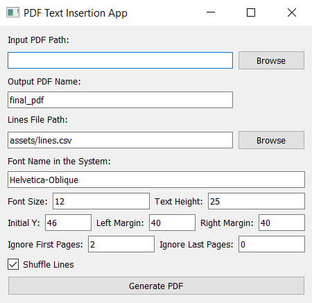

# PDF Text Inserter - LINED BLANK NOTEBOOK

This application allows you to insert text from a CSV file into a PDF document, providing customization options for text placement, font, margins, and more. It includes a user-friendly GUI built with PyQt5 for easy interaction.

<u>***Note:*</u>
---
This application is initially configured for a 6x9 inch blank lined PDF. However, it's designed to be adaptable to other dimensions. Testing with different dimensions is recommended to ensure optimal functionality.


## Features

- **PDF Text Insertion**: Insert lines of text from a CSV file into a specified PDF document.
- **Customization Options**: Adjust font size, text height, margins, and page exclusions (ignore first and last pages).
- **GUI Interface**: Intuitive GUI interface built with PyQt5 for easy file selection and customization.
- **PDF Preview**: View a preview of the original and modified PDF side by side.

## Screenshots

### GUI


### PDF Preview

| Original PDF                            | Modified PDF                            |
|-----------------------------------------|-----------------------------------------|
|  |  |

The left side of the PDF Preview shows the original PDF, while the right side shows the PDF after inserting the text from the CSV file.

## Requirements

Install the required dependencies using pip:

```bash
pip install -r requirements.txt
```

## Usage

1. Launch the application by running `app.py`.
2. Use the GUI to browse and select the input PDF, lines file (CSV, TXT, or XLSX), and customize insertion options.
3. Click on **Generate PDF** to insert the text into the PDF according to the specified options.
4. The modified PDF will be saved in the `output/` directory.

## Contributing

Contributions are welcome! Fork the repository and submit a pull request with your enhancements.

#
##
### Directory Structure

- **`app.py`**: Main application file with PyQt5 GUI implementation.
- **`main.py`**: File containing PDF text insertion logic.
- **`assets/lines.csv`**: Example CSV file with lines of text to insert.
- **`assets/line_page_pdf.pdf`**: Example PDF file for testing insertion.
- **`output/`**: Directory where generated PDFs are saved.
